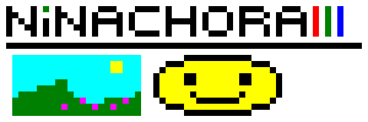
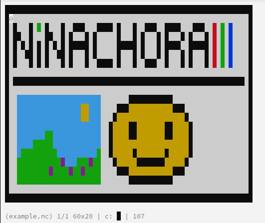

# ninachora

`ninachora` is a simple graphical terminal client for drawing pixel-art written in Lua.
Inspired by [pxltrm](https://github.com/dylanaraps/pxltrm).

|     |      |
| ---                              | ---                                 |
| SVG image created with ninachora | The same image, opened in ninachora |

# Usage

## Starting

```sh
$ ninachora [name] [x] [y]
```

Where:

* `[name]` is the name of your file (without brackets).
* `x` and `y` are the canvas' size.

## Controls

Movement uses the arrow keys.

The rest is also quite simple:

* I - Insert a pixel
* O - take Out a pixel
* C - Choose a color (1-8)
* S - Save
* E - Export
* Q - Quit (will ask if unsaved)

# Others

## Supported formats

As of right now, `ninachora` supports exporting to SVG and X PixMaps (`.xpm`).

Only `ninachora` files (`.nc`) can be opened for (re)editing. The program will interpret files intelligently, the file extension is optional.

## Name origin

From Swahili 'ninachora', which means 'to draw'.
